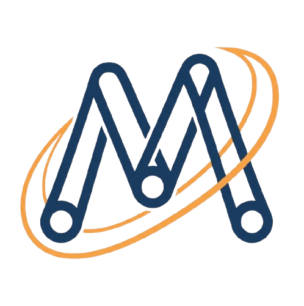

# MechanicsDSL

[](https://github.com/MechanicsDSL/mechanicsdsl/actions/workflows/python-app.yml)

[](https://opensource.org/licenses/MIT)
[](https://doi.org/10.5281/zenodo.17771040)
[](https://mechanicsdsl.readthedocs.io/en/latest/?badge=latest)

*Write a Lagrangian. Get a simulation.*

---

MechanicsDSL is a domain-specific language and compiler for physical systems. You write a Lagrangian or Hamiltonian in a LaTeX-inspired syntax; the symbolic engine (built on SymPy) derives the equations of motion automatically, and the compiler generates simulation code in your choice of thirteen target languages — from Python and C++ to CUDA, Rust, WebAssembly, and Arduino.

The goal is to collapse the distance between textbook physics and a running simulation, while keeping the path to lower-level, performance-tuned code open through code generation.

```python
from mechanics_dsl import PhysicsCompiler

compiler = PhysicsCompiler()
compiler.compile_dsl(r"""
\system{pendulum}
\defvar{theta}{Angle}{rad}
\parameter{m}{1.0}{kg}
\parameter{l}{1.0}{m}
\parameter{g}{9.81}{m/s^2}

\lagrangian{\frac{1}{2} * m * l^2 * \dot{theta}^2 - m * g * l * (1 - \cos{theta})}
\initial{theta=0.5, theta_dot=0.0}
""")

solution = compiler.simulate(t_span=(0, 10), num_points=1000)
compiler.plot(solution)
```

## What's in the box

| Component | Description |
|-----------|-------------|
| **Symbolic engine** | Derives equations of motion from Lagrangians or Hamiltonians, built on SymPy |
| **Code generation** | Thirteen targets: C++, Python, Rust, Julia, CUDA, Fortran, MATLAB, JavaScript, OpenMP, WebAssembly, Arduino, ARM, Modelica |
| **JAX backend** | GPU acceleration with JIT compilation and automatic differentiation |
| **Inverse problems** | Parameter estimation, sensitivity analysis, MCMC uncertainty quantification |
| **Jupyter integration** | `%%mechanicsdsl` magic commands for interactive notebooks |
| **Plugin architecture** | Custom physics domains and solvers without modifying the core |

> **Note on generated code.** The code generators produce working reference implementations, not production-tuned binaries. For high-performance or mission-critical work, treat the generated code as a starting point rather than a finished product.

## Installation

```bash
pip install mechanicsdsl-core
```

Optional extras:

```bash
pip install mechanicsdsl-core[jax]      # GPU + autodiff
pip install mechanicsdsl-core[jupyter]  # Notebook magic
pip install mechanicsdsl-core[all]      # Everything
```

Requires Python 3.9+. NumPy, SciPy, SymPy, and Matplotlib are installed automatically.

## Example: Figure-8 three-body orbit

```python
from mechanics_dsl import PhysicsCompiler

code = r"""
\system{figure8_orbit}
\defvar{x1}{Position}{m} \defvar{y1}{Position}{m}
\defvar{x2}{Position}{m} \defvar{y2}{Position}{m}
\defvar{x3}{Position}{m} \defvar{y3}{Position}{m}
\defvar{m}{Mass}{kg} \defvar{G}{Grav}{1}

\parameter{m}{1.0}{kg} \parameter{G}{1.0}{1}

\lagrangian{
    0.5 * m * (\dot{x1}^2 + \dot{y1}^2 + \dot{x2}^2 + \dot{y2}^2 + \dot{x3}^2 + \dot{y3}^2)
    + G*m^2/\sqrt{(x1-x2)^2 + (y1-y2)^2}
    + G*m^2/\sqrt{(x2-x3)^2 + (y2-y3)^2}
    + G*m^2/\sqrt{(x1-x3)^2 + (y1-y3)^2}
}
"""

compiler = PhysicsCompiler()
compiler.compile_dsl(code)
compiler.simulator.set_initial_conditions({
    'x1': 0.97000436,  'y1': -0.24308753, 'x1_dot': 0.466203685, 'y1_dot': 0.43236573,
    'x2': -0.97000436, 'y2': 0.24308753,  'x2_dot': 0.466203685, 'y2_dot': 0.43236573,
    'x3': 0.0,         'y3': 0.0,         'x3_dot': -0.93240737, 'y3_dot': -0.86473146
})
solution = compiler.simulate(t_span=(0, 6.326), num_points=2000)
```

The `examples/` directory contains 40+ progressive examples, from harmonic oscillators to SPH fluid dynamics.

## Code generation

Any compiled system can be exported as standalone code in any of the supported targets:

| Target | Output |
|--------|--------|
| C++ | CMake project with solver |
| Python | NumPy/SciPy standalone script |
| Rust | Cargo project, `no_std` option |
| Julia | DifferentialEquations.jl |
| CUDA | GPU-parallel solver |
| Fortran | F90 with LAPACK |
| MATLAB | `.m` script with `ode45` |
| JavaScript | Browser or Node.js |
| OpenMP | Multi-threaded C++ |
| WebAssembly | Emscripten WASM |
| Arduino | `.ino` embedded sketch |
| ARM | Raspberry Pi / NEON |
| Modelica | Standards-based FMU |

```python
from mechanics_dsl.codegen.rust import RustGenerator

gen = RustGenerator(
    system_name="pendulum",
    coordinates=compiler.get_coordinates(),
    parameters=compiler.simulator.parameters,
    initial_conditions=compiler.initial_conditions,
    equations=compiler.equations,
)
gen.generate("pendulum.rs")
```

## Physics coverage

- **Classical mechanics** — Lagrangian and Hamiltonian formulations; holonomic, non-holonomic, and rolling constraints; Rayleigh dissipation; stability analysis; Noether's theorem; central forces; canonical transformations; normal modes; rigid body dynamics; perturbation theory; collisions; scattering; variable-mass systems; continuous media.
- **Quantum mechanics** — Bound states, scattering, tunneling, WKB approximation, hydrogen atom, Ehrenfest theorem.
- **Electromagnetism** — Lorentz force, cyclotron motion, plane waves, antennas, waveguides, Penning traps.
- **Relativity** — Special: Lorentz boosts, four-vectors, Doppler effect. General: Schwarzschild and Kerr metrics, geodesics, gravitational lensing, FLRW cosmology.
- **Statistical mechanics and thermodynamics** — Microcanonical, canonical, and grand canonical ensembles; Boltzmann, Fermi-Dirac, and Bose-Einstein distributions; Ising model; heat engines; phase transitions.
- **Fluid dynamics** — SPH solver with Poly6, Spiky, and viscosity kernels; Tait equation of state; boundary conditions.

## Project status

MechanicsDSL is under active development. The v2.0.x line is stable; new features, additional backends, and broader validation are ongoing. Issues, pull requests, and use-case reports are all welcome — what the project becomes next depends in part on how people are using it.

## Documentation

Full documentation, tutorials, and DSL reference at **[mechanicsdsl.readthedocs.io](https://mechanicsdsl.readthedocs.io/)**.

## Contributing

Contributions are welcome. See [CONTRIBUTING.md](CONTRIBUTING.md) for guidelines.

## License

MIT — see [LICENSE](LICENSE).
