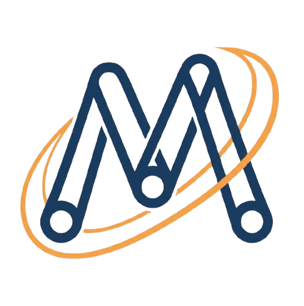

MechanicsDSL Documentation
===========================

**MechanicsDSL** is a comprehensive Python-based computational framework that unifies 
symbolic derivation and numerical simulation for classical mechanics and fluid dynamics. 
Using a LaTeX-inspired domain-specific language, it enables physicists, engineers, and 
students to describe complex physical systems in natural mathematical notation.

Key Features
------------

🔬 **Symbolic Mechanics**
   Automatic derivation of Euler-Lagrange and Hamilton's equations from Lagrangians 
   and Hamiltonians, with constraint handling via Lagrange multipliers.

💧 **Computational Fluid Dynamics**  
   Full Smoothed Particle Hydrodynamics (SPH) implementation with viscosity, pressure,
   surface tension, and multiple boundary conditions.

⚡ **High-Performance Backends**
   Generate optimized C++, OpenMP, WebAssembly, and CUDA code for production deployment.
   Achieve real-time performance with automatic parallelization.

🔗 **Multiphysics Coupling**
   Seamlessly combine rigid body dynamics with fluid mechanics for complex simulations
   like floating objects, fluid-structure interaction, and more.

📊 **Advanced Visualization**
   Real-time 3D animations, phase space portraits, Poincaré sections, energy conservation
   plots, and publication-ready figures.

Quick Start
-----------

.. code-block:: python

   from mechanics_dsl import PhysicsCompiler
   
   compiler = PhysicsCompiler()
   
   source = r'''
   \system{pendulum}
   \defvar{theta}{angle}{rad}
   \parameter{m}{1.0}{kg}
   \parameter{l}{1.0}{m}
   \parameter{g}{9.81}{m/s^2}
   \lagrangian{\frac{1}{2} m l^2 \dot{\theta}^2 - m g l (1 - \cos(\theta))}
   \initial{theta=0.5, theta_dot=0}
   '''
   
   result = compiler.compile(source)
   solution = compiler.simulate((0, 10))
   compiler.visualize()

Documentation Contents
----------------------

.. toctree::
   :maxdepth: 2
   :caption: Getting Started

   getting_started/installation
   getting_started/quickstart
   getting_started/tutorials

.. toctree::
   :maxdepth: 2
   :caption: User Guide

   user_guide/guide
   user_guide/dsl_syntax
   user_guide/physics_background
   user_guide/code_generation
   user_guide/performance_optimization
   user_guide/cuda_guide

.. toctree::
   :maxdepth: 2
   :caption: Physics Domains

   physics/lagrangian_mechanics
   physics/hamiltonian_mechanics
   physics/kinematics
   physics/constraint_physics
   physics/dissipation
   physics/stability
   physics/symmetry
   physics/central_forces
   physics/canonical
   physics/oscillations
   physics/rigid_body
   physics/perturbation
   physics/nonholonomic
   physics/collisions
   physics/scattering
   physics/variable_mass
   physics/continuum
   physics/fluid_dynamics
   physics/multiphysics
   physics/electromagnetic
   physics/relativistic
   physics/quantum
   physics/statistical
   physics/thermodynamics
   physics/general_relativity

.. toctree::
   :maxdepth: 2
   :caption: API Reference

   api/core
   api/domains
   api/visualization
   api/analysis
   api/codegen
   api/io
   api/utils

.. toctree::
   :maxdepth: 2
   :caption: Code Generation

   codegen/overview
   codegen/cpp
   codegen/python
   codegen/wasm
   codegen/cuda
   codegen/openmp
   codegen/julia
   codegen/rust
   codegen/fortran
   codegen/matlab
   codegen/javascript
   codegen/arduino

.. toctree::
   :maxdepth: 2
   :caption: Advanced Topics

   advanced_topics/advanced
   advanced_topics/performance
   advanced_topics/extending
   advanced_topics/architecture

.. toctree::
   :maxdepth: 1
   :caption: Project

   project/changelog
   project/contributing
   project/license

Indices and Tables
------------------

* :ref:`genindex`
* :ref:`modindex`
* :ref:`search`

Version Information
-------------------

:Version: |version|
:Release: |release|
:Date: |today|

License
-------

MechanicsDSL is released under the MIT License. See :doc:`project/license` for details.

Citation
--------

If you use MechanicsDSL in your research, please cite:

.. code-block:: bibtex

   @software{mechanicsdsl,
     title = {MechanicsDSL: A Domain-Specific Language for Classical Mechanics},
     author = {Parsons, Noah},
     year = {2024},
     url = {https://github.com/MechanicsDSL/mechanicsdsl}
   }
